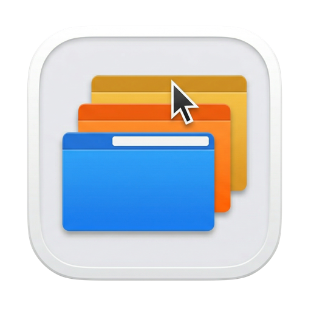
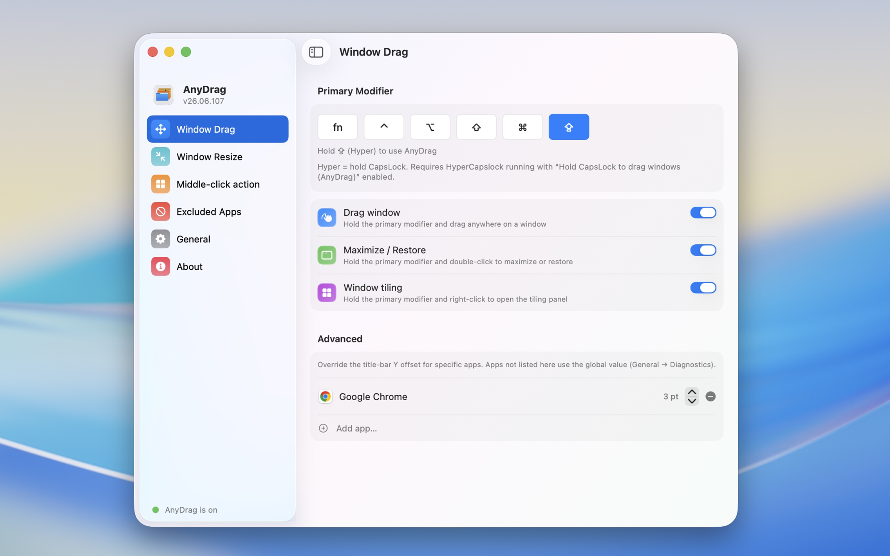
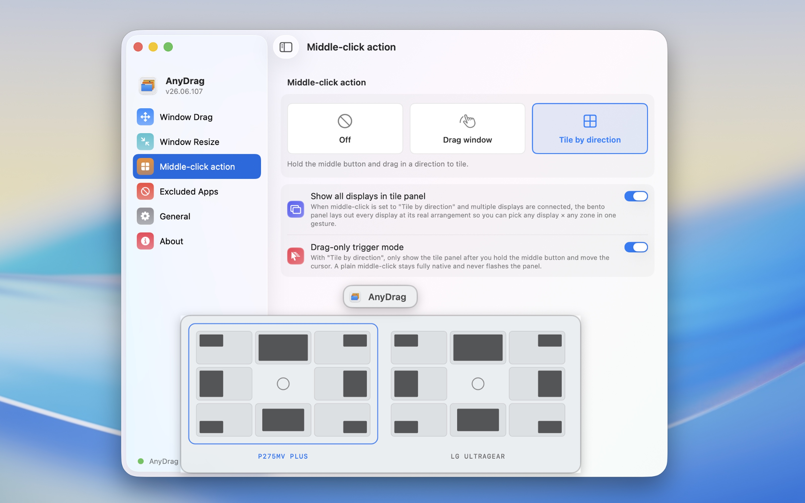

<h1 align="center">
  <br/>
  AnyDrag
</h1>

<p align="center">
  <b>Move any window by holding a modifier and dragging anywhere on it — as smooth as a native title bar.</b>
</p>

<p align="center">
  <b>🇺🇸 English</b> •
  <a href="README_CN.md">🇨🇳 中文</a>
</p>

<p align="center">
  <a href="https://github.com/XueshiQiao/AnyDrag/actions/workflows/build.yml"></a>
  <a href="https://github.com/XueshiQiao/AnyDrag/releases/latest"></a>
  <a href="LICENSE"></a>
  
  <a href="https://github.com/XueshiQiao/AnyDrag/stargazers"></a>
</p>

<p align="center">
  ⭐ <b>If AnyDrag makes your windows feel better, please <a href="https://github.com/XueshiQiao/AnyDrag">star the repo</a></b> — it helps others find it.
</p>

Move any window by holding a modifier key and dragging **anywhere** on it — no need to aim for the title bar.

https://github.com/user-attachments/assets/82b18801-0f96-4e9d-b05a-ac7cdd18d490

## Why AnyDrag?

Tools like BetterTouchTool offer similar modifier-drag features, but they move windows through the **Accessibility API** — an indirect path that routes every frame through the target app's process, adding noticeable lag.

AnyDrag takes a different approach: it simulates a **native title-bar drag at the window-server level**. The window moves exactly the way it does when you grab its real title bar by hand — zero per-frame IPC, no Accessibility round-trips, no lag. That smoothness is the whole point, and no other modifier-drag tool on macOS matches it.

## ✨ Features

Everything below is configured through a native System-Settings-style window — there are no config files to hand-edit.

### 🪟 Core gestures

Hold your **primary modifier** (Option by default) and:

| Gesture | Action |
|---------|--------|
| **Modifier + drag** | Move the window from anywhere on it — not just the title bar |
| **Modifier + double-click** | Maximize the window; double-click again to restore its original size |
| **Modifier + right-click** | Open the **tiling panel** |

### 🗂️ Tiling panel

Modifier + right-click opens a panel to quickly arrange the window:

- **Move & Resize** — snap to halves, quarters, or any zone
- **Fill & Arrange** — fill the screen, or lay multiple windows out side by side
- **Full Screen** — go full screen in one click
- **Move to display** — send the window straight to another monitor

### ↔️ Window Resize

Resize a window from its **nearest corner** without aiming for the tiny corner handle. It's opt-in, with two trigger modes:

- **Right-drag** — hold the primary modifier and right-drag.
- **Left-drag** — hold a dedicated *Left-drag Resize Modifier* and left-drag.

A glowing **Corner Bracket** indicator marks the active corner during the resize (toggleable for best performance).

### 🖱️ Middle-click → Tile by direction

Set the **middle-click action** to *Tile by direction*, then hold the middle button and drag toward an edge or corner to snap.

On a multi-monitor setup the panel lays out **every display at its real arrangement**, so you can pick *any display × any zone* in a single gesture. A *drag-only trigger mode* keeps a plain middle-click fully native — the panel only appears once you start moving.

### ⌨️ Modifier keys

Choose your primary modifier — or a combo:

- **Option**, **Command**, **Control**, **Shift**, **fn**
- Combos like **Option + Command**
- **Hyper** — hold **Caps Lock** as the trigger. This works together with the sibling app [HyperCapslock](https://github.com/XueshiQiao/HyperCapslock) (enable *"Hold CapsLock to drag windows (AnyDrag)"*).

> If macOS "Hold ⌥ to tile windows while dragging" is enabled and AnyDrag's modifier is **not** Option, you can hold Option as an extra key for native tiling. For example, with AnyDrag set to `fn`, `fn + option + drag` starts a native drag from anywhere in the window and still triggers system tiling.

### 🛠️ More

- **Excluded apps** — list apps where AnyDrag never engages at all.
- **Per-app fine-tuning** — override the title-bar offset for specific apps when needed.
- **Launch at login**, **menu-bar control**, light/dark following the system.
- **Localized UI** — English / 简体中文 (follows the system language).
- **Auto-update** — built-in [Sparkle](https://sparkle-project.org).
- **Privacy first** — optional anonymous usage stats, off-limits to app names and window contents, and one toggle to turn them off entirely.

## Usage

1. Launch AnyDrag — it lives in your menu bar.
2. Hold **Option** (default) and drag any window.
3. Hold the modifier and **double-click** a window to maximize it; double-click again to restore.
4. Hold the modifier and **right-click** a window to open the **tiling panel**.
5. Or set **Middle-click action** to *Tile by direction*, then hold the middle button and drag toward an edge or corner.
6. Click the menu-bar icon to change the modifier key or toggle AnyDrag on/off.

## Screenshots





## Install

### Homebrew

```bash
brew install --cask XueshiQiao/tap/anydrag
```

<details>
<summary>Prefer the two-step form?</summary>

```bash
brew tap XueshiQiao/tap
brew install --cask anydrag
```
</details>

Or download the latest `.dmg` from [GitHub Releases](https://github.com/XueshiQiao/AnyDrag/releases) and drag AnyDrag into your Applications folder.

The app is signed with an Apple Developer ID certificate and notarized by Apple, so it installs without any security warnings.

### Permissions

On first launch macOS asks for **Accessibility** permission — required to detect the modifier key and move windows:
`System Settings → Privacy & Security → Accessibility`

## How It Works

A `CGEventTap` runs on a dedicated high-priority thread and intercepts mouse events only while the modifier is held. Instead of asking the Accessibility API to move the window frame by frame, AnyDrag **rewrites the mouse coordinates into the window's title-bar region** so the window server performs the drag natively — the exact same code path as grabbing the real title bar, with zero per-frame IPC.

That is why dragging feels native: there is no intermediary moving the window, the window server is doing it directly.

## Tech Stack

- **Native macOS** — AppKit core (engine, menu bar, overlays); the Settings window is SwiftUI hosted in an `NSHostingController`. Swift 5.9, macOS 13+.
- CoreGraphics `CGEventTap` for input interception; window-server title-bar drag simulation for movement.
- [Sparkle](https://sparkle-project.org) for auto-update.
- [XcodeGen](https://github.com/yonaskolb/XcodeGen) — `project.yml` is the single source of truth for the Xcode project.

## Build from Source

### Prerequisites

- macOS 13+
- Xcode 16+
- [XcodeGen](https://github.com/yonaskolb/XcodeGen) (`brew install xcodegen`)

### Setup

```bash
git clone https://github.com/XueshiQiao/AnyDrag.git
cd AnyDrag
brew install xcodegen
xcodegen generate
open AnyDrag.xcodeproj   # Cmd+R to build & run
```

`project.yml` is the single source of truth for the Xcode project; run `xcodegen generate` after changing it.

## Known Issues

- When used together with macOS three-finger drag, there is a one-frame snap flicker at drag-end.

## License

GPL v3.0 — see [LICENSE](LICENSE).
