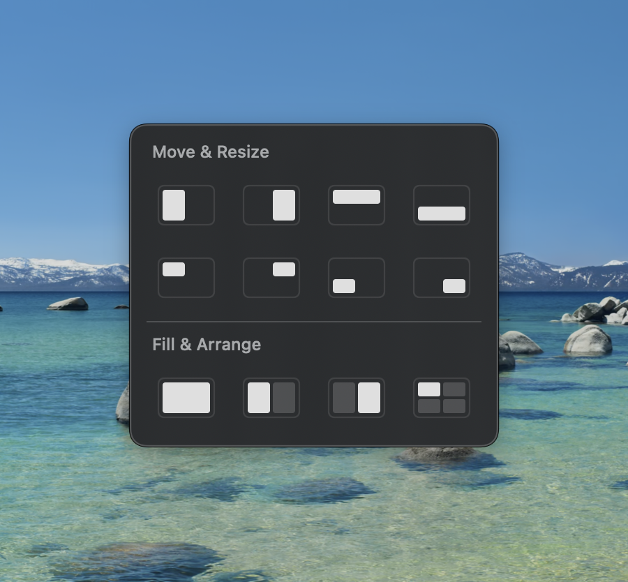

# AnyDrag

[English](README.md)

按住修饰键，拖动窗口任意位置即可移动窗口，无需拖拽标题栏。

<!--  -->

## 为什么选择 AnyDrag？

BetterTouchTool 等工具也有类似的修饰键+拖动功能，但它们通过 Accessibility API 移动窗口——这条路径要经过目标 app 的进程，延迟明显。AnyDrag 采用不同的方案：在 window server 层面模拟原生标题栏拖动，流畅度和手动拖标题栏完全一致。

## 安装

从 [Releases](https://github.com/XueshiQiao/AnyDrag/releases) 下载最新 `.dmg`，打开后将 AnyDrag 拖到应用程序文件夹。

应用已使用 Apple 开发者证书签名，并通过了 Apple 公证（Notarization），可以直接安装，不会出现安全警告。

首次启动时 macOS 会请求**辅助功能权限**——这是检测修饰键和移动窗口所必需的。

## 使用

1. 启动 AnyDrag — 它会出现在菜单栏
2. 按住 **Option**（默认）拖动任意窗口
3. 按住修饰键**双击**窗口可最大化；再次双击恢复原窗口大小
4. 按住修饰键**右键点击**窗口打开**窗口布局面板**——快速将窗口吸附到半屏、四分之一屏，或多窗口并排排列

   
5. 点击菜单栏图标可以切换修饰键或开关

### 支持的修饰键

- Option
- Command
- Control
- fn
- Option + Command

## 要求

- macOS 13+

## 从源码构建

```bash
brew install xcodegen
git clone https://github.com/XueshiQiao/AnyDrag.git
cd AnyDrag
xcodegen generate
open AnyDrag.xcodeproj
```

然后在 Xcode 中构建并运行（⌘R）。

## 许可

GPL-3.0
