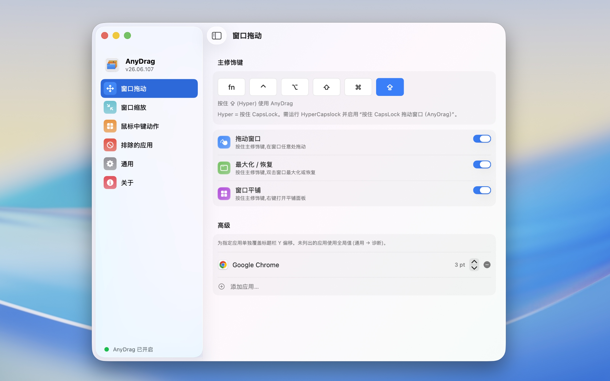
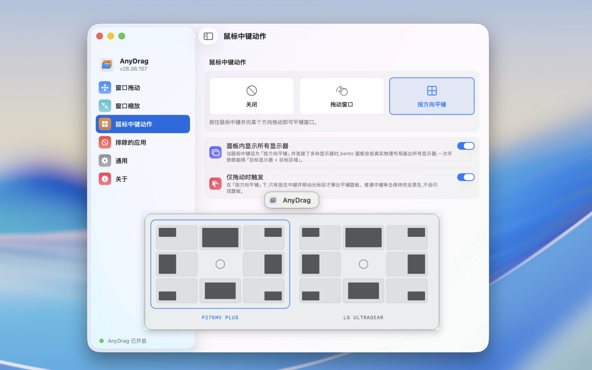

<p align="center">
  <b><a href="https://xueshi.dev">✨ 我做的更多应用 → xueshi.dev</a></b>
</p>

<h1 align="center">
  <br/>
  AnyDrag
</h1>

<p align="center">
  <b>按住修饰键，拖动窗口任意位置即可移动它——丝滑得宛如原生标题栏。</b>
</p>

<p align="center">
  <a href="README.md">🇺🇸 English</a> •
  <b>🇨🇳 中文</b>
</p>

<p align="center">
  <a href="https://github.com/XueshiQiao/AnyDrag/actions/workflows/build.yml"></a>
  <a href="https://github.com/XueshiQiao/AnyDrag/releases/latest"></a>
  <a href="LICENSE"></a>
  
  <a href="https://github.com/XueshiQiao/AnyDrag/stargazers"></a>
</p>

<p align="center">
  ⭐ <b>如果 AnyDrag 让你的窗口拖动更顺手，欢迎给个 <a href="https://github.com/XueshiQiao/AnyDrag">Star</a></b> —— 能帮更多人发现它。
</p>

按住修饰键，拖动窗口**任意位置**即可移动窗口，无需对准标题栏。

https://github.com/user-attachments/assets/82b18801-0f96-4e9d-b05a-ac7cdd18d490

## 为什么选择 AnyDrag？

BetterTouchTool 等工具也有类似的修饰键+拖动功能，但它们通过 **Accessibility API** 移动窗口——这条间接路径要让每一帧都经过目标 app 的进程，延迟明显。

AnyDrag 采用不同的方案：在 **window server 层面模拟原生标题栏拖动**。窗口的移动方式和你亲手拖它真正的标题栏完全一致——没有逐帧 IPC，没有 Accessibility 往返，没有延迟。这份丝滑正是它存在的意义，macOS 上其他修饰键拖动工具都做不到。

## ✨ 功能

下面所有内容都通过一个原生「系统设置」风格的窗口配置，无需手写任何配置文件。

### 🪟 核心手势

按住你的**主修饰键**（默认 Option），然后：

| 手势 | 动作 |
|------|------|
| **修饰键 + 拖动** | 从窗口任意位置移动它——不限于标题栏 |
| **修饰键 + 双击** | 最大化窗口；再次双击恢复原始大小 |
| **修饰键 + 右键** | 打开**窗口布局面板** |

### 🗂️ 窗口布局面板

修饰键 + 右键会弹出一个面板，快速排布窗口：

- **移动与缩放** —— 吸附到半屏、四分之一屏或任意区域
- **填充与排列** —— 填满屏幕，或将多个窗口并排排列
- **全屏** —— 一键进入全屏
- **移动到显示器** —— 把窗口直接送到另一块显示器

### ↔️ 窗口缩放

从**最近的窗口角**缩放窗口，无需对准角落那一小块拖拽区。该功能默认关闭，提供两种触发方式：

- **右键拖动** —— 按住主修饰键并右键拖动。
- **左键拖动** —— 按住专门的「左键缩放修饰键」并左键拖动。

缩放过程中，活动角会有一个发光的**角标（Corner Bracket）**指示（可关闭以获得最佳性能）。

### 🖱️ 鼠标中键 → 按方向平铺

把**鼠标中键动作**设为「按方向平铺」，然后按住中键往某个边或角拖动即可吸附。

多显示器时，面板会**按真实排列铺开所有屏幕**，一个手势即可选「任意屏 × 任意区域」。还有一个「仅拖动触发」模式，让普通的中键单击保持完全原生——只有真正移动光标后面板才出现。

### ⌨️ 修饰键

选择你的主修饰键，或是组合键：

- **Option**、**Command**、**Control**、**Shift**、**fn**
- 像 **Option + Command** 这样的组合
- **Hyper** —— 按住 **Caps Lock** 作为触发键。它与姊妹应用 [HyperCapslock](https://github.com/XueshiQiao/HyperCapslock) 配合使用（开启其中的「按住 CapsLock 拖动窗口（AnyDrag）」）。

> 如果你在 macOS 中开启了「按住 ⌥ 键拖移窗口以平铺」，并且 AnyDrag 的修饰键**不是** Option，那么也可以额外按住 Option 使用系统平铺。例如把 AnyDrag 设为 `fn` 后，可以直接用 `fn + option + 拖动` 从窗口任意区域触发原生拖动和平铺。

### 🛠️ 更多

- **排除应用** —— 列出那些让 AnyDrag 完全不介入的 app。
- **按应用微调** —— 必要时为特定 app 覆盖标题栏偏移量。
- **开机自启**、**菜单栏控制**、浅色/深色跟随系统。
- **多语言界面** —— 英文 / 简体中文（跟随系统语言）。
- **自动更新** —— 内置 [Sparkle](https://sparkle-project.org)。
- **隐私优先** —— 可选的匿名使用统计，不涉及 app 名称和窗口内容，并提供一个开关彻底关闭。

## 使用

1. 启动 AnyDrag —— 它会出现在菜单栏。
2. 按住 **Option**（默认）拖动任意窗口。
3. 按住修饰键**双击**窗口可最大化；再次双击恢复原大小。
4. 按住修饰键**右键点击**窗口，打开**窗口布局面板**。
5. 或把**鼠标中键动作**设为「按方向平铺」，然后按住中键往某个边/角拖动。
6. 点击菜单栏图标可以切换修饰键或开关 AnyDrag。

## 截图





## 安装

### Homebrew

```bash
brew install --cask XueshiQiao/tap/anydrag
```

<details>
<summary>想用两步式写法？</summary>

```bash
brew tap XueshiQiao/tap
brew install --cask anydrag
```
</details>

或者从 [GitHub Releases](https://github.com/XueshiQiao/AnyDrag/releases) 下载最新 `.dmg`，打开后将 AnyDrag 拖到应用程序文件夹。

应用已使用 Apple 开发者证书签名，并通过了 Apple 公证（Notarization），可以直接安装，不会出现安全警告。

### 权限

首次启动时 macOS 会请求**辅助功能（Accessibility）**权限——这是检测修饰键和移动窗口所必需的：
`系统设置 → 隐私与安全性 → 辅助功能`

## 它是如何工作的

一个 `CGEventTap` 运行在专属的高优先级线程上，只在修饰键被按住时拦截鼠标事件。AnyDrag 不是让 Accessibility API 逐帧移动窗口，而是把**鼠标坐标改写到窗口的标题栏区域**，让 window server 原生地完成这次拖动——和你抓住真正标题栏走的是同一条代码路径，没有任何逐帧 IPC。

这就是拖动手感原生的原因：没有中间层在搬运窗口，是 window server 在直接做这件事。

## 技术栈

- **原生 macOS** —— AppKit 核心（引擎、菜单栏、覆盖层）；设置窗口为 SwiftUI，通过 `NSHostingController` 承载。Swift 5.9，macOS 13+。
- CoreGraphics `CGEventTap` 拦截输入；用 window server 标题栏拖动模拟来移动窗口。
- [Sparkle](https://sparkle-project.org) 实现自动更新。
- [XcodeGen](https://github.com/yonaskolb/XcodeGen) —— `project.yml` 是 Xcode 工程配置的唯一来源。

## 从源码构建

### 前置要求

- macOS 13+
- Xcode 16+
- [XcodeGen](https://github.com/yonaskolb/XcodeGen)（`brew install xcodegen`）

### 配置

```bash
git clone https://github.com/XueshiQiao/AnyDrag.git
cd AnyDrag
brew install xcodegen
xcodegen generate
open AnyDrag.xcodeproj   # Cmd+R 构建并运行
```

`project.yml` 是 Xcode 工程配置的唯一来源；修改它之后请运行 `xcodegen generate`。

## 已知问题

- 与系统三指拖移联用时，drag-end 会有一帧 snap 闪烁。

## 许可证

GPL v3.0 —— 见 [LICENSE](LICENSE)。
